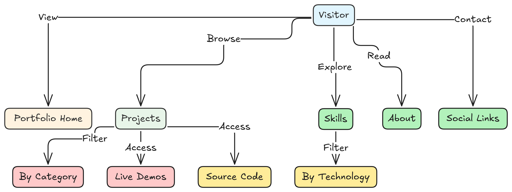

# DevHamza Portfolio

<div align="center">
  
  <h3 align="center">Full-Stack & FullStack Developer Portfolio</h3>
  <p align="center">
    A modern, responsive portfolio website showcasing my skills, projects, and professional experience.
  </p>
</div>

## 📋 Overview

This portfolio website serves as a comprehensive showcase of my skills, projects, and professional journey as a Full-Stack and FullStack Developer. Built with modern web technologies, it features a responsive design, smooth animations, and an intuitive user interface.

## 📊 Project Architecture

### User Flow Diagram
This diagram illustrates how users navigate through the portfolio:

<div align="center">
  
</div>

### Use Case Diagram
This diagram shows the main interactions available to visitors:

<div align="center">
  
</div>

### ✨ Live Demo

[View Live Portfolio](https://devHamza.vercel.app/)

## 🚀 Features

- **Responsive Design**: Optimized for all devices from mobile to desktop
- **Modern UI/UX**: Clean, professional interface with smooth animations
- **Interactive Sections**:
  - Hero section with animated elements
  - About section with detailed professional information
  - Skills showcase with categorized technologies
  - Project portfolio with filtering capabilities
  - Contact information with social media links
- **Performance Optimized**: Fast loading times and smooth scrolling
- **Accessibility Focused**: WCAG compliant for all users
- **Dark Mode Support**: Elegant appearance in both light and dark modes

## 🛠️ Technologies Used

- **Frontend Framework**: React with TypeScript
- **Build Tool**: Vite
- **Styling**: Tailwind CSS
- **UI Components**: shadcn/ui
- **Animations**: Framer Motion
- **Icons**: Lucide React
- **Smooth Scrolling**: React Scroll

## 🧰 Project Structure

```
portfolio-website/
├── public/               # Static assets
│   ├── icons/            # Skill and technology icons
│   ├── me.jpeg            # Profile image
│   └── resume.pdf        # Downloadable resume
├── src/
│   ├── components/       # React components
│   │   ├── hero-section.tsx
│   │   ├── about-section.tsx
│   │   ├── skills-section.tsx
│   │   ├── projects-section.tsx
│   │   ├── contact-section.tsx
│   │   └── ...
│   ├── layouts/          # Layout components
│   ├── styles/           # Global styles
│   └── App.tsx           # Main application component
└── index.html            # Entry HTML file
```

## 🚦 Getting Started

### Prerequisites

- Node.js (v16 or higher)
- npm or yarn

### Installation

1. Clone the repository:
   ```bash
   git clone https://github.com/HamzaK01/portfolio-website.git
   cd portfolio-website
   ```

2. Install dependencies:
   ```bash
   npm install
   # or
   yarn install
   ```

3. Start the development server:
   ```bash
   npm run dev
   # or
   yarn dev
   ```

4. Open your browser and navigate to `http://localhost:5173`

## 🔧 Customization

This portfolio is designed to be easily customizable:

- **Personal Information**: Update your details in the respective component files
- **Projects**: Modify the projects array in `projects-section.tsx`
- **Skills**: Adjust your skills in `skills-section.tsx`
- **Theme**: Customize colors in `tailwind.config.ts`
- **Content**: Edit text content in each section component

## 📱 Responsive Design

The portfolio is fully responsive with breakpoints for:
- Mobile devices (< 640px)
- Tablets (640px - 1024px)
- Desktops (> 1024px)

## 🚢 Deployment

This project can be deployed to various platforms:

- **Vercel**: Recommended for easy deployment
  ```bash
  npm run build
  # Then deploy using Vercel CLI or GitHub integration
  ```

- **Netlify**: Another excellent option
  ```bash
  npm run build
  # Then deploy using Netlify CLI or GitHub integration
  ```

- **GitHub Pages**: For simple hosting
  ```bash
  npm run build
  # Configure for GitHub Pages deployment
  ```

## 📄 License

This project is licensed under the MIT License - see the [LICENSE](LICENSE) file for details.

## 📬 Contact

- **Email**: Hamza81khan81@gmail.com
- **LinkedIn**: [Hamza Khan](https://www.linkedin.com/in/hamza-khan-3a2b0024a/)

---

<div align="center">
  <p>Designed & Developed with ❤️ by Hamza Khan</p>
</div>
